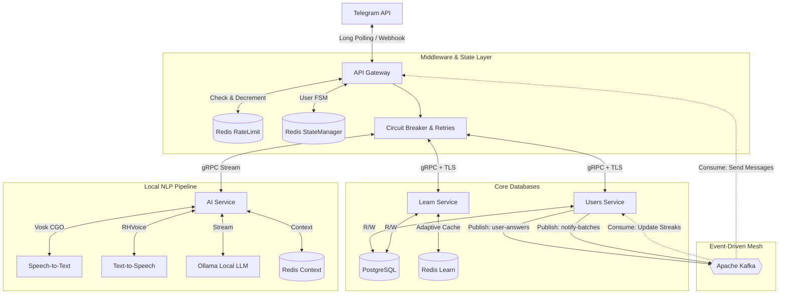

# 🚀 EnBooster — Microservices Language Learning Telegram Bot

<p align="center">
  <a href="https://go.dev"></a>
  
  
  
  
  
  
  <a href="https://opensource.org/licenses/MIT"></a>
</p>

**EnBooster** is a production-grade, event-driven Telegram bot designed to gamify and accelerate language learning. Built on a robust microservices architecture in Go, it leverages ultra-fast gRPC communication, algorithmic caching, distributed state management, and local NLP processing pipelines.

The system is designed with enterprise-level resilience, featuring circuit breakers, asynchronous event streaming via Apache Kafka, and strict memory optimization techniques (like `sync.Pool` for audio processing and zero-allocation functions).

---

## 🏗 Microservice Architecture

The platform separates domains into heavily isolated microservices. The API Gateway acts as the sole entry point from the Telegram API, routing messages through a strict middleware pipeline before orchestrating downstream RPC calls.

* **API Gateway (`gateway`)**: Built with `gopkg.in/telebot.v3`. Manages Telegram updates, handles user state machines via Redis, enforces rate limits, and processes background notifications from Kafka.
* **Learn Service (`learn-service`)**: Core algorithmic engine handling educational tasks, vocabulary distribution, and the logic for the "Shiritori" word game. Employs advanced adaptive caching mechanisms.
* **Users Service (`users-service`)**: Manages user profiles, language levels, atomic streak calculations, learning statistics (best/worst themes), and schedules localized notification batches.
* **AI Service (`ai-service`)**: A fully localized, CGO-enabled processing pipeline for offline speech-to-text (Vosk), text-to-speech (RHVoice), and conversational practice (Ollama). 

### Network Topology & Data Flow



---

## ✨ Key Technical Features

### 1. Algorithmic Learning & Gamification Engine

The core of the bot relies on structured algorithms rather than LLMs to enforce learning mechanics:

* **Shiritori Word Game**: Implements a strict algorithmic validation flow. Words are fetched from PostgreSQL using B-Tree indexed queries (`offset_id`, `first_letter`). The system guarantees unique word usage per session and strictly tracks the last letter offset to prevent rule violations.
* **Atomic Statistics & Streaks**: Uses `sq.Expr` in PostgreSQL for atomic database transactions to increment daily learning streaks, calculate time-deltas, and dynamically adjust the user's "best" and "worst" learning themes based on historical accuracy.

### 2. High-Performance Middlewares & Caching

* **Adaptive Cache-Aside Pattern**: The `learn-service` implements an intelligent caching layer using Redis and `golang.org/x/sync/singleflight`. A Lua script atomically counts requests; if a specific task request surpasses a threshold (e.g., >30 hits), it is dynamically cached to prevent database hammering.
* **Sliding Window Rate Limiter**: The Gateway intercepts incoming Telegram updates and throttles spammers using a custom middleware backed by Redis Lua scripts, strictly managing Request-Per-Second limits.
* **Fault Tolerance**: All downstream gRPC calls are wrapped in a `sony/gobreaker` Circuit Breaker with an exponential backoff retry fallback mechanism.

### 3. Event-Driven Architecture (EDA) via Kafka

To decouple heavy background processing from the synchronous user request-response cycle, the system uses Apache Kafka (in KRaft mode):

* **Async Streak Updates**: When a user answers a task, the gateway immediately acknowledges it. A Kafka producer publishes a `UserAnswer` event, which a background consumer reads to atomically update the user's streak and theme stats in PostgreSQL.
* **Scheduler & Rate-Limited Notifications**: A cron-like scheduler inside the `users-service` analyzes users without completed tasks for the day. It batches chat IDs and streams them into Kafka. The Gateway consumes this topic and dispatches Telegram messages adhering to Telegram's strict `30 RPS` broadcasting limit.

### 4. Localized NLP Processing Pipeline

Instead of relying on external paid APIs, the bot implements a fully local, air-gapped media processing unit:

* **Memory-Optimized Audio**: Uses CGO bindings for Vosk (STT) and local binaries for RHVoice (TTS). Implements `sync.Pool` for PCM byte buffers to drastically reduce Garbage Collection pressure during audio chunking.
* **gRPC Streaming**: Integrates Ollama for conversational practice using server-side gRPC streaming. The Gateway listens to the chunked byte stream and dynamically edits the Telegram message every second to create a typing effect without hitting rate limits.

---

## 🛠 Memory Optimization & Code Foundations

* **Zero-Allocation Utilities**: Custom `itoa` functions and heavy reliance on pre-allocated slices (`make([]T, 0, cap)`) during notification batching and Kafka message generation.
* **Graceful Shutdown**: Intercepts `SIGINT`/`SIGTERM` globally. Implements a `Closable` interface to smoothly drain active gRPC streams, flush PostgreSQL connection pools, and commit Kafka offsets before container termination.
* **State Machine Pattern**: User flows (e.g., waiting for an answer, changing AI settings, playing Shiritori) are managed via a robust State Machine (`statemanager`) cached in Redis with a 30-minute TTL, allowing stateless horizontal scaling of the Gateway.

---

## 🐳 Deployment (Docker & Kubernetes)

The infrastructure is designed to be cloud-native and deployable in containerized environments.

### Kubernetes (`k8s/`)

The repository contains full Kubernetes manifests for deploying the system into a cluster:

* **Persistent Volume Claims (PVC)**: Used for PostgreSQL data retention across pod restarts.
* **Secret Management**: Environment variables and database credentials mapped via K8s Secrets.
* **Service Discovery**: Internal routing handled via Kubernetes ClusterIP services for seamless gRPC communication.

### Docker Compose Local Setup

Create an `.env` file matching the provided example, then spin up the entire cluster (PostgreSQL, 4x Redis instances, Kafka, Ollama, and 4 Go microservices) using:

```bash
docker compose up --build -d

```

*Kafka is configured to run in KRaft mode (no Zookeeper) with auto-topic creation enabled. PostgreSQL automatically applies `init.sql` schema files on the first boot.*

---

## 📜 Open Source Acknowledgements

**EnBooster** relies on the following excellent open-source libraries:

| Dependency | Purpose |
| --- | --- |
| **[telebot.v3](https://gopkg.in/telebot.v3)** | Telegram Bot API framework for the Gateway. |
| **[grpc-go](https://github.com/grpc/grpc-go)** | High-performance RPC framework for internal service mesh. |
| **[go-redis/redis](https://github.com/go-redis/redis)** | Driver for rate-limiting, caching, and state management. |
| **[sqlx](https://github.com/jmoiron/sqlx)** | General extension layer for Go standard database tools. |
| **[squirrel](https://github.com/Masterminds/squirrel)** | Fluid SQL query builder for dynamic PostgreSQL statements. |
| **[lib/pq](https://github.com/lib/pq)** | Pure Go Postgres driver for database connections. |
| **[kafka-go](https://github.com/segmentio/kafka-go)** | Pure Go Kafka client for event streaming. |
| **[gobreaker](https://github.com/sony/gobreaker)** | Circuit Breaker pattern implementation. |
| **[go-vosk](https://github.com/alphacep/vosk-api)** | Offline speech recognition toolkit via CGO bindings. |
| **[golang/sync](https://pkg.go.dev/golang.org/x/sync)** | Concurrency primitives (Singleflight) for Cache-Aside. |
| **[zap](https://github.com/uber-go/zap)** | Blazing fast, structured, leveled logging. |

---

  - **License:** This project is licensed under [MIT](LICENSE)
  - **Third-party Licenses:** Third-party [licenses/](licenses/).
